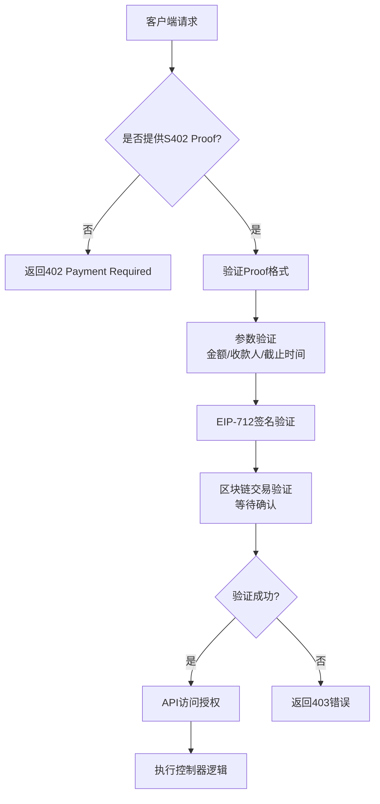
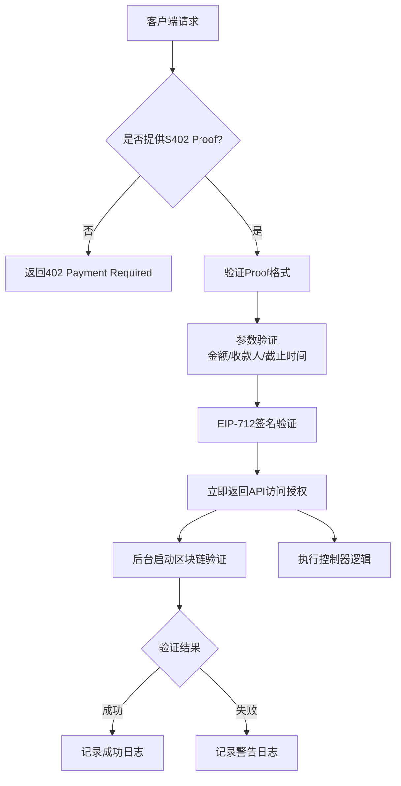

# S402 支付验证流程对比

本文档对比了 S402 支付验证的两种执行流程：同步验证和异步验证。

## 路由定义对比

```typescript
// 同步验证路由
router.post("/v1/tool/example-async", requireS402Async("tool.example"), toolController.runExample);

// 异步验证路由  
router.get("/v1/tool/analytics", requireS402("tool.analytics"), toolController.analytics);
```

## 同步验证流程 (requireS402)



### 同步验证特点

- **阻塞式验证**: 等待区块链交易完全确认后才继续
- **强一致性**: 确保支付在链上完全确认后才授权访问
- **响应延迟**: 需要等待区块链确认，响应时间较长
- **安全性高**: 完全验证后才提供服务

## 异步验证流程 (requireS402Async)



### 异步验证特点

- **非阻塞验证**: 签名验证通过后立即授权，区块链验证在后台进行
- **最终一致性**: 允许在区块链确认完成前访问API
- **响应快速**: 无需等待区块链确认，用户体验更好
- **风险可控**: 依赖EIP-712签名验证作为主要安全机制

## 核心差异对比

| 特性 | 同步验证 (requireS402) | 异步验证 (requireS402Async) |
|------|----------------------|---------------------------|
| **验证时机** | 请求处理期间等待完整验证 | 签名验证后立即响应 |
| **区块链确认** | 等待确认完成 | 后台异步验证 |
| **响应时间** | 较长（等待区块链） | 较短（仅签名验证） |
| **一致性保证** | 强一致性 | 最终一致性 |
| **安全性** | 最高（双重验证） | 较高（签名验证为主） |
| **适用场景** | 高价值/敏感操作 | 常规API调用 |

## 技术实现差异

### 同步验证关键代码
```typescript
// 等待区块链验证完成
const verification = await verifyTransactionSettlement(proof.txHash!, proof.payment);
if (!verification.verified) {
    throw new Error(`Transaction verification failed: ${verification.error}`);
}
```

### 异步验证关键代码  
```typescript
// 立即返回，后台验证
const verificationPromise = verifyTransactionSettlement(proof.txHash!, proof.payment);
return {
    // ... 其他字段
    verifiedAsync: true,
    verificationPromise  // 用于后台处理
};
```

## 使用建议

- **同步验证**: 适用于金融交易、敏感数据访问等需要最高安全保证的场景
- **异步验证**: 适用于常规API调用、用户体验优先的场景，通过签名验证提供足够的安全性

两种验证方式都提供了强大的支付验证机制，选择取决于具体业务场景的安全性和性能需求。