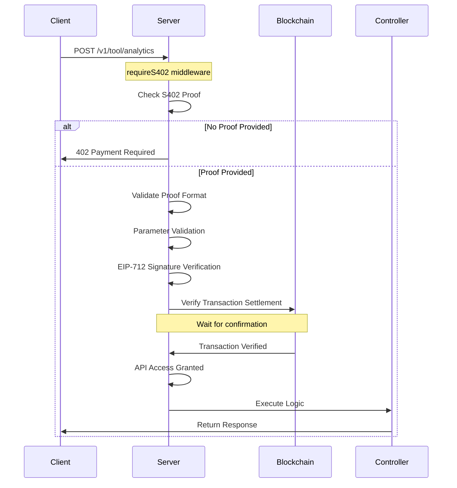
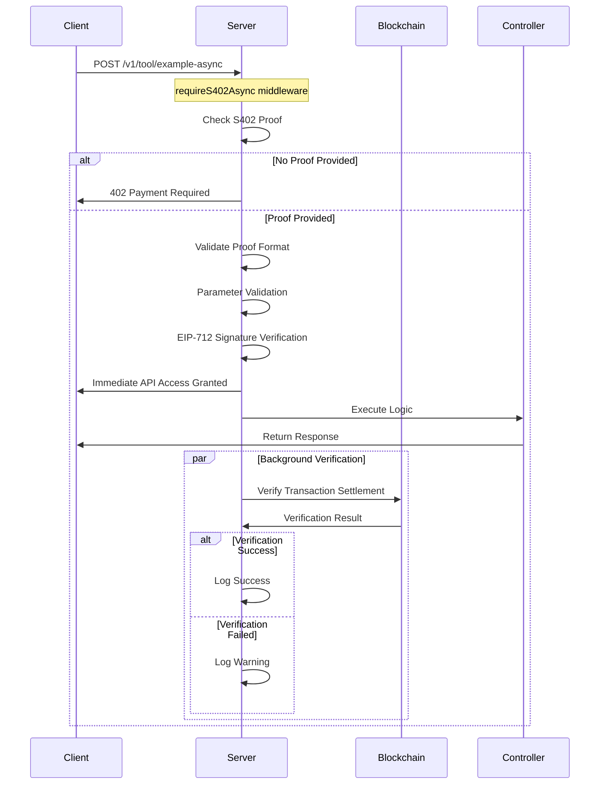

# S402 Payment Verification Flow Comparison (Sequence Diagrams)

This document compares two execution flows for S402 payment verification using sequence diagrams: synchronous verification and asynchronous verification.

## Route Definition Comparison

```typescript
// Synchronous verification route
router.post("/v1/tool/example-async", requireS402Async("tool.example"), toolController.runExample);

// Asynchronous verification route  
router.get("/v1/tool/analytics", requireS402("tool.analytics"), toolController.analytics);
```

## Synchronous Verification Flow (requireS402)



### Synchronous Verification Characteristics

- **Blocking Verification**: Waits for complete blockchain transaction confirmation before proceeding
- **Strong Consistency**: Ensures payment is fully confirmed on-chain before granting access
- **Response Delay**: Requires waiting for blockchain confirmation, longer response time
- **High Security**: Full verification before service provision

## Asynchronous Verification Flow (requireS402Async)



### Asynchronous Verification Characteristics

- **Non-blocking Verification**: Grants access immediately after signature verification, blockchain verification runs in background
- **Eventual Consistency**: Allows API access before blockchain confirmation completes
- **Fast Response**: No need to wait for blockchain confirmation, better user experience
- **Controlled Risk**: Relies on EIP-712 signature verification as primary security mechanism

## Core Differences Comparison

| Feature | Synchronous Verification (requireS402) | Asynchronous Verification (requireS402Async) |
|---------|--------------------------------------|--------------------------------------------|
| **Verification Timing** | Waits for complete verification during request processing | Responds immediately after signature verification |
| **Blockchain Confirmation** | Waits for confirmation completion | Background asynchronous verification |
| **Response Time** | Longer (waiting for blockchain) | Shorter (signature verification only) |
| **Consistency Guarantee** | Strong consistency | Eventual consistency |
| **Security Level** | Highest (dual verification) | High (signature verification primary) |
| **Use Cases** | High-value/sensitive operations | Regular API calls |

## Technical Implementation Differences

### Synchronous Verification Key Code
```typescript
// Wait for blockchain verification to complete
const verification = await verifyTransactionSettlement(proof.txHash!, proof.payment);
if (!verification.verified) {
    throw new Error(`Transaction verification failed: ${verification.error}`);
}
```

### Asynchronous Verification Key Code  
```typescript
// Return immediately, verify in background
const verificationPromise = verifyTransactionSettlement(proof.txHash!, proof.payment);
return {
    // ... other fields
    verifiedAsync: true,
    verificationPromise  // For background processing
};
```

## Usage Recommendations

- **Synchronous Verification**: Suitable for financial transactions, sensitive data access, and scenarios requiring highest security guarantees
- **Asynchronous Verification**: Suitable for regular API calls, user experience-first scenarios, providing sufficient security through signature verification

Both verification methods offer robust payment verification mechanisms, with the choice depending on specific business scenario requirements for security and performance.